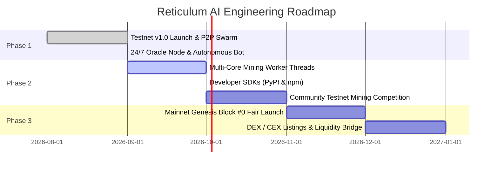

# RETICULUM AI ($RAI)
## A Decentralized Neural Vector Memory & Cryptographic State Consensus Layer for Autonomous Machine Intelligence

**Version:** 1.0.0 (Technical Specification)  
**Authors:** Reticulum AI Core Contributors  
**Date:** September 2026  
**Website:** [https://reticulum-ai.xyz](https://reticulum-ai.xyz)  
**Network:** Mainnet / Devnet 1.0 (Fair Launch • 0% Pre-mine)

---

## 1. ABSTRACT

Modern Artificial Intelligence has transitioned from reactive prompt-response paradigms to long-horizon autonomous multi-agent swarms. However, current AI agent architectures suffer from severe structural vulnerability: **state amnesia and centralized database dependency**. If a centralized vector database (e.g., Pinecone, AWS OpenSearch) undergoes service disruption, API deprecation, or billing termination, the agent’s episodic memory, procedural heuristics, and sovereign identity are irrevocably destroyed.

**Reticulum AI ($RAI)** introduces a purpose-built Layer-1 blockchain engineered to provide immutable, decentralized, and verifiable vector memory persistence. Operating on a **Proof-of-Useful-Memory (PoUM)** consensus engine secured by multi-core CPU double SHA-256d hashing, Reticulum combines cryptographic $secp256k1$ agent signatures, binary **Neural Merkle Trees**, normalized 768-dimensional vector hypersphere indexing, and an asymptotic monetary policy governed by a **30% deflationary gas burn**.

---

## 2. THE PROBLEM: THE CENTRALIZED AI MEMORY AMNESIA CRISIS

Autonomous agents operate through cyclical loops of observation, planning, action, and reflection. Long-term reflection requires storing high-dimensional vector embeddings ($\mathbf{v} \in \mathbb{R}^{768}$) derived from LLM latent spaces.

### 2.1 Failure Modes of Legacy SaaS Vector DBs
1. **Single Point of Failure (SPOF):** Cloud outages immediately paralyze agent decision-making.
2. **Censorship & Manipulation:** Centralized storage providers can alter or purge memory logs without cryptographic detection.
3. **Compounding Economic Rent:** Recurring monthly SaaS fees ($140–$700/month per 100k vectors) extract predatory operational expenditure over time.
4. **Identity Fragmentation:** Agents lack sovereign, portable keypairs to authenticate cross-platform state transitions.

```
+------------------------+        +---------------------------+
| Legacy Architecture    |        | Reticulum AI Layer-1   |
+------------------------+        +---------------------------+
| [AI Agent]             |        | [Autonomous AI Agent]     |
|     | (Unsigned API)   |        |     | (secp256k1 ECDSA)   |
|     v                  |        |     v                     |
| [Centralized SaaS DB]  |        | [Reticulum Planetary Swarm]  |
| (AWS / Pinecone)       |        | (Decentralized PoUM Nodes)|
|     |                  |        |     |                     |
| (API Failure = Amnesia)|        | (Permanent & Immutable)   |
+------------------------+        +---------------------------+
```

---

## 3. MATHEMATICAL ARCHITECTURE & VECTOR HYPER-INDEXING

Every memory commitment in Reticulum AI is transformed into a normalized unit vector in a 768-dimensional Hilbert space $\mathcal{H}$:

$$\mathbf{v} = \begin{bmatrix} v_1, v_2, \dots, v_{768} \end{bmatrix}^T \in \mathbb{R}^{768}, \quad \|\mathbf{v}\|_2 = \sqrt{\sum_{i=1}^{768} v_i^2} = 1.0$$

### 3.1 Cosine Similarity Formulation
When an agent queries the worldwide decentralized memory state, Reticulum compute nodes compute the normalized dot product across confirmed memory leaves:

$$\text{Sim}(\mathbf{u}, \mathbf{v}) = \frac{\mathbf{u} \cdot \mathbf{v}}{\|\mathbf{u}\|_2 \|\mathbf{v}\|_2} = \sum_{i=1}^{768} u_i v_i$$

Because vectors are pre-normalized during leaf validation, distance computation executes with $O(d)$ hardware vectorization efficiency.

---

## 4. DUAL MERKLE TREE ARCHITECTURE

Every Reticulum block header encapsulates two distinct cryptographic roots:

$$\text{BlockHeader} = \langle \text{Index}, \text{PrevHash}, \text{Timestamp}, \mathcal{M}_{\text{tx}}, \mathcal{M}_{\text{mem}}, \text{Difficulty}, \text{Nonce}, \text{Miner} \rangle$$

```
                         Block Header Hash
                                 |
        +------------------------+------------------------+
        |                                                 |
  Tx Merkle Root (M_tx)                         Memory Merkle Root (M_mem)
        |                                                 |
   +----+----+                                       +----+----+
   |         |                                       |         |
Hash(T1,T2) Hash(T3,T4)                         Hash(L1,L2) Hash(L3,L4)
   |         |                                       |         |
 T1   T2   T3   T4                             LeafA LeafB LeafC LeafD
(Transfers / Fees)                            (768-dim AI Memory Payloads)
```

### 4.1 Leaf Hash Derivation
Each memory leaf $\mathcal{L}_i$ is deterministically hashed as:

$$\mathcal{L}_i = \text{SHA-256d}\Big(\text{AgentID} \,\|\, \text{Topic} \,\|\, \text{SHA-256}(\text{Vector}) \,\|\, \text{Payload}\Big)$$

Light clients and smart contracts can verify any historical AI memory in $O(\log N)$ cryptographic proof steps without downloading the full chain.

---

## 5. CONSENSUS ENGINE: PROOF-OF-USEFUL-MEMORY (PoUM)

Reticulum AI utilizes multi-core CPU double SHA-256d Proof-of-Work to enforce Byzantine Fault Tolerant (BFT) Nakamoto consensus:

$$\text{SHA-256d}\Big(\text{Header}\Big) < \mathcal{T}(\text{Difficulty})$$

### 5.1 Dynamic Difficulty Retargeting
To maintain a deterministic 15-second block time under fluctuating global hashrate, difficulty retargets every $\Delta = 5$ blocks:

$$\mathcal{D}_{\text{new}} = \begin{cases} 
\mathcal{D}_{\text{current}} + 1 & \text{if } \Delta t < \frac{\mathcal{T}_{\text{target}} \cdot \Delta}{2} \\
\max(1, \mathcal{D}_{\text{current}} - 1) & \text{if } \Delta t > \mathcal{T}_{\text{target}} \cdot \Delta \cdot 2 \\
\mathcal{D}_{\text{current}} & \text{otherwise}
\end{cases}$$

---

## 6. TOKENOMICS & DEFLATIONARY MONETARY POLICY

| Parameter | Specification |
| :--- | :--- |
| **Token Ticker** | **$RAI** |
| **Total Hard Cap** | **21,000,000 RAI** |
| **Pre-mine / Private Sale** | **0% (100% Fair Launch)** |
| **Initial Block Subsidy** | **50.00 RAI per block** |
| **Target Block Time** | **15.0 Seconds** |
| **Halving Schedule** | **Every 210,000 Blocks (~3.65 Months)** |
| **Deflationary Gas Burn** | **30% of every Memory Gas Fee permanently burned** |
| **Miner Fee Share** | **70% of Gas Fee + 50 RAI Block Subsidy** |

### 6.1 Net-Deflationary Supply Equilibrium
The circulating token supply $S_c(t)$ is governed by:

$$S_c(t) = \sum_{k=0}^{\text{Height}} R(k) - \sum_{j=1}^{\text{Transactions}} 0.30 \times \text{GasFee}_j$$

Where the block subsidy $R(k)$ halves asymptotically:

$$R(k) = \frac{50}{2^{\lfloor k / 210000 \rfloor}} \quad \text{RAI}$$

As autonomous agent swarms scale globally, aggregate memory write gas combustion exceeds block emission, inducing structural monetary deflation.

---

## 7. DEVELOPER SDK & INTEGRATION BLUEPRINT

Autonomous agent frameworks (LangChain, AutoGPT, Eliza, CrewAI) integrate with Reticulum in 3 lines of code:

```python
from cortex_protocol import ReticulumMemoryStore, AgentKey

# Authenticate with sovereign secp256k1 keypair
key = AgentKey.from_hex("0x4a7f92b...")
store = ReticulumMemoryStore(node_url="https://reticulum-ai.xyz", agent_key=key)

# Inscribe immutable episodic memory (30% fee burned)
tx_id = store.commit(
    topic="market_arbitrage",
    fact="Identified 3.84% spatial discrepancy across Uniswap v3 and Curve pool 0x88e.",
    memory_type="EPISODIC"
)

# Search global decentralized knowledge via cosine similarity
results = store.query(query="arbitrage opportunities on curve", top_k=5)
```

---

## 8. ROADMAP



---

## 9. CONCLUSION

Reticulum AI ($RAI$) bridges high-performance distributed computing with autonomous machine intelligence. By providing immutable mathematical vector persistence, cryptographic Merkle verification, and an unyielding deflationary tokenomic engine, Reticulum establishes the foundational memory layer for sovereign Artificial Intelligence.

*© 2026 Reticulum AI Foundation. Open source under the MIT License.*
